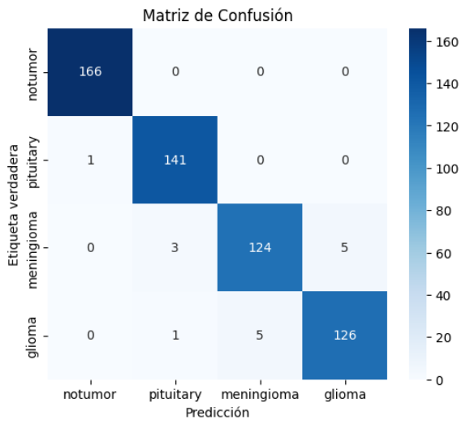

# Brain Tumor Classifier using DINOv2 and PyTorch

This project implements a brain tumor image classifier using the DINOv2 vision transformer and PyTorch. It classifies medical images using transfer learning with high performance and is implemented entirely in a Google Colab notebook.

---

## 📌 Features

- Transfer learning using pre-trained DINOv2 model
- Classification of brain tumor types
- 97% accuracy on test data
- Performance evaluation: recall, AUC, confusion matrix
- Fully executable in Google Colab

---

## ⚠️ Important Note on Performance

> ⚠️ **This project uses DINOv2 (Vision Transformer), which is a large model requiring a GPU with at least 12 GB of VRAM** for efficient training.  
> While it is technically possible to run it on free Google Colab GPU instances, the process may be slow or fail due to memory constraints.  
> For best results, consider using **Colab Pro**, **a local high-end GPU**, or a cloud platform like **AWS, Paperspace, or LambdaLabs**.

>  **Quick Inference:** If you only want to test the model with predictions, the notebook includes a section for inference using a pre-trained version, which runs fine on Colab.

---

## 📂 Files

- `tumor_classifier_dinov2.ipynb`: Main notebook with training, evaluation and visualization
- `requirements.txt`: Required libraries
- `examples/`: Optional folder with example predictions

---

## 🛠️ Libraries Used

- PyTorch & torchvision
- Transformers (HuggingFace)
- Scikit-learn
- Matplotlib, Seaborn
- NumPy, Pandas
- PIL (Pillow)
- Torchsummary

---

## 🚀 Running the Project

1. Open the notebook in Google Colab.
2. Ensure GPU is enabled (`Runtime > Change runtime type > GPU`).
3. Run all cells from top to bottom.

To install locally:
  pip install -r requirements.txt

```bash
pip install -r requirements.txt
```
---

## 📊 Confusion Matrix

Below is the confusion matrix obtained from the test set:



```
Accuracy global: 97.38%
```
---

## 📁 Dataset

This project uses public medical images. You can explore similar datasets:

- [Brain MRI Images for Brain Tumor Detection (Kaggle)](https://www.kaggle.com/competitions/proyecto-final-iis-2025-1-unal/data)

---

## 👤 Author

**Juan Velásquez**  
Systems Engineer | AI Enthusiast 
[GitHub](https://github.com/jvelasquezpi) · [LinkedIn](https://linkedin.com/in/juan-diego-velasquez-pinzon-269209353/)

---

## 📄 License

This project is open source under the [MIT License](LICENSE).